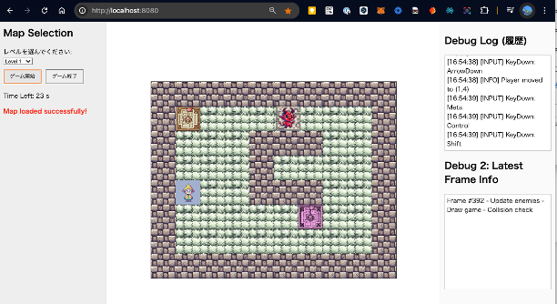

# 個人ゲームプロジェクト

HTML + JavaScript + JSON で動くサンプルゲームです。  
**AI（ChatGPT）** で作ったコードをベースに、マップやアセット等は外部ファイルに分離してあります。


---


## ゲームの説明

このサンプルゲームでは、マップ上をプレイヤーが上下左右のキー入力で移動し、ゴール地点を目指します。  
タイルには、壁（通れない）やトラップ（触れると危険）、スタート地点、ゴール地点などが配置されています。

- **スタート地点 (S)**  
  プレイヤーの初期位置です。ゲーム開始後、ここから動き出します。

- **ゴール地点 (G)**  
  目的地です。プレイヤーが到達するとゲームクリアになります。

- **壁 (#)**  
  通行できないマスです。移動しようとしても進めません。

- **床 (空白 / E)**  
  通れるマスです。E は外部で定義されたエネミー配置などに利用することもあります。

- **敵やトラップ**  
  当たるとゲームオーバーになる仕掛けです。マスに近づくと衝突判定が入り、ライフが 0 になるか即ゲーム終了となります。

また、タイトル画面では ASCIIアートが表示され、BGM (title.mp3) が流れます。  
「ゲーム開始」ボタンを押すとゲーム中 (game.mp3) の音楽が鳴り、上下左右キーで操作可能になります。  
ゴールに着くか、指定の条件を満たすとエンディング処理が走り、再びタイトルへ戻ります。


下記は、実行時の画面サンプルです。
マップやキャラクタ配置は、各種 JSON ファイルやアセット画像を編集して自由に変更できます。




---

## ファイル構成

- **index.html**  
  画面表示と Canvas、ボタンなどのUIを定義

- **style.css**  
  シンプルなレイアウトや色指定

- **script.js**  
  メインロジック  
   - **MapLevel.json** と **assets_config.json** を読み込み  
   - **title.txt** でタイトル画面のASCIIアート  
   - タイトルBGM: **title.mp3**、ゲーム中BGM: **game.mp3**  
   - シーン（"title" / "game"）の切り替えと、BGM再生/停止を制御  
   - キーボード操作（上下左右）や衝突判定、タイマー処理などをまとめて記述

- **MapLevel.json**  
  マップのタイル配置を定義（壁 `#`、床 ` `、スタート `S`、ゴール `G`、など）

- **assets_config.json**  
  画像や音声ファイルのパスを定義  
  - `"wall": "assets/wall.png"` などをここで指定

- **title.txt**  
  タイトル画面で表示するASCIIアートと案内文

- **assets/**  
  - 画像 (player.png, trap.png, など)
  - 音声 (title.mp3, game.mp3)
  - ICON.png (サイトアイコン) などまとめて配置

---

## 実行方法

1. **リポジトリをダウンロード**  
   - ZIPを解凍、または `git clone` 後、ディレクトリに移動

2. **ローカルサーバーを起動**  
   - Node.js:
     ```bash
     npx http-server
     ```
   - または Python:
     ```bash
     python -m http.server 8080
     ```
   - 表示された URL で `index.html` にアクセス

3. **ブラウザで操作**  
   - レベル選択後「ゲーム開始」ボタンでゲームへ  
   - 「ゲーム終了」ボタンでタイトル画面に戻る  
   - ↑↓←→キーでプレイヤーを移動

---

## ポイント

- **ロジック (script.js) とデータ (MapLevel.json, assets_config.json)** を分離  
  - 後からマップやアセットを変更しやすい  
- **タイトル画面**も `title.txt` に外部化  
- **BGM**をシーンごとに再生/停止 (title.mp3, game.mp3)  
- **キーボード操作**や衝突判定を `script.js` 内でまとめて管理

短いコードでも、AIの力を借りて拡張や修正が簡単にできます。ぜひ色々改造して遊んでみてください！
